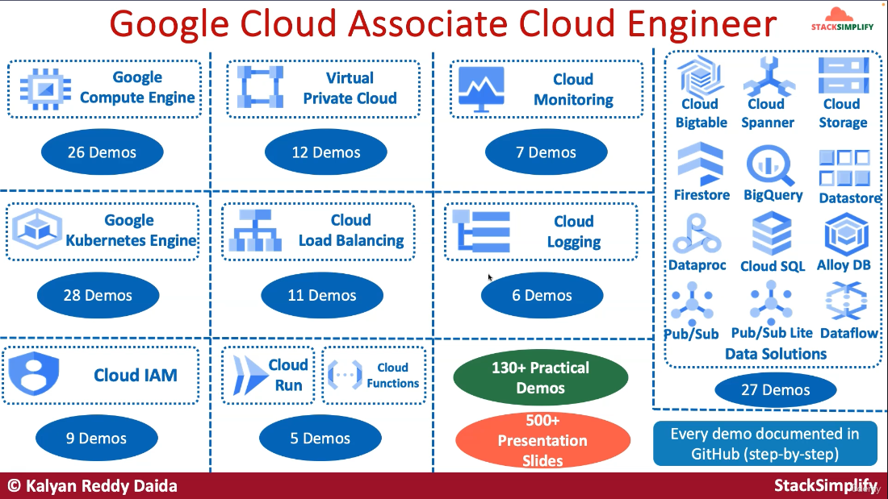

# GCP associate cloud engineer google certification - 150 demos (Udemy)

- URL: https://tcsglobal.udemy.com/course/gcp-associate-cloud-engineer-google-certification/learn/lecture/43762536#overview
- Source code: https://github.com/stacksimplify/google-cloud-certifications
- PPT: https://github.com/stacksimplify/google-cloud-certifications/blob/main/course-presentation/GCP-Associate-Cloud-Engineer-v5-Live.pdf

Index

Compute engine
- Google compute engine, 9 examples
- Persistent disks 9 examples
- Instance groups, 3 examples
- SSH keys, 5 examples

K8S
- K8s workload resources, 2
- K8s deployments, 4
- Other resources, 3
- K8s services 4
- K8s Jobs, 6
- Cluster mgnt, 1
- GKE cluster types, 3
- GKE autoscaling, 3
- K8S storage, 2

IAM
- Cloud IAM, 9

VPC
- VPC Types, 1
- VPC Networking, 5
- VPC Firewall rules, 6

Cloud LB
- Cloud Loald balancing, 11

Cloud run & cloud functions
- Cloud run, 2
- Cloud functions, 3

Cloud Data Solutions
- Cloud SQL, 3
- Cloud Dataflow, 1
- Cloud Spanner, 3
- Alloy DB, 1
- Cloud Dataproc, 2
- Cloud pub/sub, Pub/sub lite
- Cloud storage, 6
- Cloud BigQuery, 2

Cloud Monitoring
- Cloud Monitoring, 7
- Cloud logging, 6