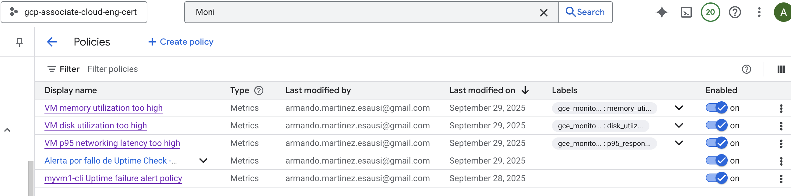

# Cloud Observability


**Products**

Cloud Monitoring
- Monitoring and alert
- Alerting mechanisms: Google chat, Pager duty, Slack, Webhooks, email, SMS, Pub/Sub

Managed Service for Prometheus
- Monitor using Managed Prometheus

Cloud Trace
- Latency mangement solution: microservices, service to service latency
- Require development to enable trace libraries (SDK)

Cloud Profiles
- Performance and cost management solution
- Provides continuous profiling of resource consumption (CPU/memoria usage)

Service Monitoring
- Google way to manage our own services
- Microservices, to define SLO

Cloud loging
- End to end log management for all logs: user logs, platform logs, audit logs, app logs

Log Analytics
- Run queries that analyze your log data using SQL
- Can create logging datasets in serverless BigQuery platform

Cloud Audit Logs
- All user activity on GCP is logged to Cloud Audit logs
    - Who did what
    - When they did
    - Where they did

## Cloud Monitoring
- Charts and dashboards
- Alerts and notifications
- SLO monitoring and uptime checks

Monitoring scope,
- Application monitoring
    - App uptime checks
    - Current connections
    - Accepted connections
    - Request rate
- VM Instance monitoring
    - High CPU utilization
    - High Memory utilization
    - High disk utilization
    - Host error log detected

### Alerts: Alert policy
Steps,
- Create alert policy
- Configure notification channel
- Attend the alert

```shell
# Instance creation with startup script initialization file
gcloud auth login
gcloud config set project thematic-bee-473421-i7 #gcp-associate-cloud-eng-cert
# Create instance
gcloud compute instances create myvm1-cli \
--zone=us-central1-a \
--machine-type=e2-micro \
--network-interface=subnet=default \
--tags=http-server \
--image-project=debian-cloud \
--image-family=debian-12 \
--metadata-from-file startup-script=webserver-install.sh

# Create incident, stop Instance 
gcloud compute instances stop override-projlev-startuscript-cli \
  --zone=northamerica-south1-a \
```

Create uptime check
- GCP Console -> Cloud Monitoring -> Detect -> Uptime checks
Target
    - Protocol: HTTP
    - Resource type: Instance
    - Applies to: Single
    - Instance myvm1-cli
    - Path: /index.html
    - Frequency: 1 min
    - Region: Global [CONTINUE]
Response Validation
    - Content matching is enagled: ENABLE
    - Response Content Match Type: Contains
    - Response content: Welcome [CONTINUE] 
Alert & Notification
    - Name: myvm1-cli Uptime failure alert policy
    - Notification channels
        - Email: XXXX@gmail.com [CONTINUE]
Review
    - Name: myvm1-cli Uptime failure alert policy [TEST] [CREATE]

```shell
# Channels list
gcloud beta monitoring channels list \
  --format="table(name, displayName, type)"

projects/thematic-bee-473421-i7/notificationChannels/1388338056318751704

# Uptime check by CLI
gcloud monitoring uptime create myvm1-cli-uptime-failure-alert-policy-cli \
  --resource-type="gce-instance" \
  --resource-labels="project_id=thematic-bee-473421-i7,instance_id=3623674085473797431,zone=us-central1-a" \
  --path="/index.html" \
  --protocol="http" \
  --port=80 \
  --period="15" \
  --timeout="60" \
  --regions="usa-oregon,usa-virginia,usa-iowa" \
  --matcher-type="contains-string" \
  --matcher-content="Welcome" \
  --status-codes=200 

Created uptime [projects/thematic-bee-473421-i7/uptimeCheckConfigs/myvm1-cli-uptime-failure-alert-policy-cli-yrZKws0TxEM].

#--regions="us-central1,us-east1" \
#  --host="myvm1-cli" \
#  --period=300s \
#--check-interval="300s"
#--resource-labels="project_id=thematic-bee-473421-i7" \
#--display-name="myvm1-cli Uptime failure alert policy-cli" \

cat alert_policy.json
{
  "displayName": "Alerta por fallo de Uptime Check - [Nombre de tu Uptime Check]",
  "combiner": "OR",
  "conditions": [
    {
      "displayName": "Fallo de Uptime Check",
      "conditionThreshold": {
        "filter": "metric.type=\"monitoring.googleapis.com/uptime_check/check_passed\" AND resource.type=\"uptime_url\"",
        "comparison": "COMPARISON_LT",
        "thresholdValue": 1,
        "duration": "60s",
        "trigger": {
          "count": 1
        },
        "aggregations": [
          {
            "alignmentPeriod": "60s",
            "crossSeriesReducer": "REDUCE_NONE",
            "perSeriesAligner": "ALIGN_MEAN"
          }
        ]
      }
    }
  ],
  "notificationChannels": [
    "projects/[ID_DE_TU_PROYECTO]/notificationChannels/[ID_DE_TU_CANAL]"
  ],
  "documentation": {
    "content": "La verificación de tiempo de actividad de la aplicación ha fallado. Revisa la disponibilidad de la URL."
  }
}

gcloud alpha monitoring policies create --policy-from-file="alert_policy.json"

Created alert policy [projects/thematic-bee-473421-i7/alertPolicies/5600586303508698924].
```

Alarm analysis/Review
- Uptime check is 0, means 0 instances are breaking threshold

```shell
# Create incident, stop Instance 
gcloud compute instances stop myvm1-cli \
  --zone=us-central1-a 
Stopping instance(s) myvm1-cli...done.                                                                                                               
Updated [https://compute.googleapis.com/compute/v1/projects/thematic-bee-473421-i7/zones/us-central1-a/instances/myvm1-cli].
```

Incident/alert was fired and email notification was sent
Not lets "solve" the issue starting instance again

```shell
# Create incident, stop Instance 
gcloud compute instances start myvm1-cli \
  --zone=us-central1-a 
  Starting instance(s) myvm1-cli...done.                                                                                                               
Updated [https://compute.googleapis.com/compute/v1/projects/thematic-bee-473421-i7/zones/us-central1-a/instances/myvm1-cli].
Instance internal IP is 10.128.0.2
Instance external IP is 34.69.9.153

# SSH instance
gcloud compute ssh --zone "us-central1-a" "myvm1-cli" --project "thematic-bee-473421-i7"
Updating project ssh metadata...⠶Updated [https://www.googleapis.com/compute/v1/projects/thematic-bee-473421-i7].                                    
Updating project ssh metadata...done.                                                                                                                
Waiting for SSH key to propagate.
Warning: Permanently added 'compute.3623674085473797431' (ED25519) to the list of known hosts.
Linux myvm1-cli 6.12.48+deb13-cloud-amd64 #1 SMP PREEMPT_DYNAMIC Debian 6.12.48-1 (2025-09-20) x86_64

The programs included with the Debian GNU/Linux system are free software;
the exact distribution terms for each program are described in the
individual files in /usr/share/doc/*/copyright.

Debian GNU/Linux comes with ABSOLUTELY NO WARRANTY, to the extent
permitted by applicable law.

armando@myvm1-cli:~$ tail -100f /var/log/nginx/access.log
35.205.234.10 - - [29/Sep/2025:03:43:20 +0000] "GET /index.html HTTP/1.1" 200 252 "-" "GoogleStackdriverMonitoring-UptimeChecks(https://cloud.google.com/monitoring)"
35.199.12.162 - - [29/Sep/2025:03:43:50 +0000] "GET /index.html HTTP/1.1" 200 252 "-" "GoogleStackdriverMonitoring-UptimeChecks(https://cloud.google.com/monitoring)"
```

## VM Instance alert policies

To create VM Instance alert policies it is required to be installed the **Ops agent**

To validate Ops agent is installed on an instance,
- Compute Engine -> VM Instances -> Select Instance -> Observability -> Overview -> Graphs, should show "Requires Ops agent **INSTALL**"

OR
- Observability Monitoring -> Dashboards -> VM Instances -> List Tab -> Instance -> Agent Column: Not detected

### Install Ops agent using Console
- Observability Monitoring -> Dashboards -> VM Instances -> List Tab -> Select Instance [INSTALL/UPDATE OPS AGENT]

### Install Ops agent using SSH
- Compute Engine -> VM Instances -> Select Instance -> SSH -> View gcloud command -> Copy command & Execute

```gcloud compute ssh --zone "us-central1-a" "myvm1-cli" --project "thematic-bee-473421-i7"```

NOTE: To be able to install Ops client, it is required an Agent policy

```shell
#Create an instance with debian 12, 13 is not compatible
gcloud compute instances create myvm1-cli \
--zone=us-central1-a \
--machine-type=e2-micro \
--network-interface=subnet=default \
--tags=http-server \
--image-project=debian-cloud \
--image-family=debian-12 \
--metadata-from-file startup-script=webserver-install.sh
```

Install Ops agent using Console
- Observability Monitoring -> Dashboards -> VM Instances -> List Tab -> Select Instance [INSTALL/UPDATE OPS AGENT]

```shell
# Validate agent is running
sudo service google-cloud-ops-agent status

# It not running, start it
sudo service google-cloud-ops-agent start
```

Create recommended alert at instance level

- Observability Monitoring -> Dashboards -> VM Instances -> List Tab -> Select Instance [CREATE RECOMMENDED ALERTS]



## Proactive monitor
Types,
- Uptime checks: Query and app that responds to HTTP/HTTPS/TCP. Validate the response data. Public or Private endpoints
- Synthetic Monitors: 
  - Suite of tests
  - Cloud functions trigger periodically, possibility to generate code using Gemini. Types: Custom & Mocha
- Broken link checkers: Periodically test a configurable number of links

### Synthetic monitoring

Following [example](https://github.com/stacksimplify/google-cloud-certifications/tree/main/Cloud-Monitoring/04-Synthetic-Monitor-Custom-Script) was created
- Synthetic monitoring with Cloud Run Function in Node20 to esausi.com every 15 mins
  - Created 2 Images in GAR
  - Create a Synthetic monitor
  - Created an alert policy
  - Deployed a Cloud Run function

TBD: Check tomorrow, once validated delete resources