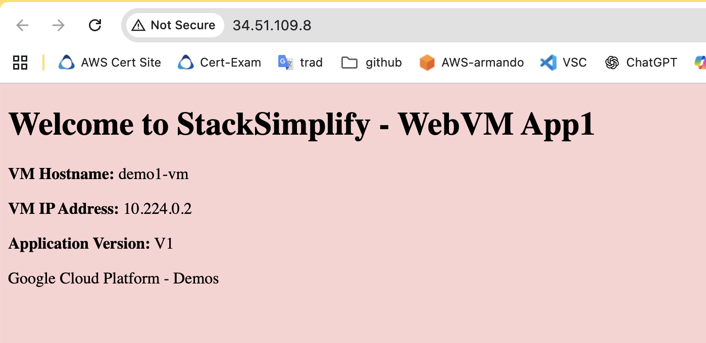

# GCP Compute engine service

## 1. Creation a VM instance

URL: [Compute-Engine/01-Compute-Engine-VM-Instances/01-01-VMInstance-Basics](https://github.com/stacksimplify/google-cloud-certifications/tree/main/Compute-Engine/01-Compute-Engine-VM-Instances/01-01-VMInstance-Basics)

```shell
#Install nginX upload shell script to the instance
./webserver-install.sh

#test webserver
curl localhost

#IP on linux GCP VM
ip -s addr
...
2: ens4: <BROADCAST,MULTICAST,UP,LOWER_UP> mtu 1460 qdisc mq state UP group default qlen 1000
    link/ether 42:01:0a:e0:00:02 brd ff:ff:ff:ff:ff:ff
    altname enp0s4
    inet 10.224.0.2/32 metric 100 scope global dynamic ens4
       valid_lft 3165sec preferred_lft 3165sec
    inet6 fe80::4001:aff:fee0:2/64 scope link 
       valid_lft forever preferred_lft forever
    RX:  bytes packets errors dropped  missed   mcast           
       1096240    1375      0       0       0       0 
    TX:  bytes packets errors dropped carrier collsns           
        185773    1127      0       0       0       0 

#Access external IP from a Web browser
```



## 2. Managing a VM instance

Stop/Start
- Maintain: Persistent disk, Internal IPs and MAC address
- Lose: PublicIP
- Pricing: Will be charged by disk & Static IP addresses
- Why: Change instance type, save cost, add/remove disk. **TERMINATED state = Stopped instance in GCP**

Suspend/Resume
- Maintain: OS memory->Storage, device state & app stage. Up to 60 days, then stoped
- Use cases: Dev/Test envs, Apps with long time for initialization
- Pricing: Storage for memory, disk, static IPs

Reset/Delete
- What?: Similar of hard reset on you computer to initial state. No clean shutdown. VM remains in RUNNING state
- Delete: Remove associated resources and remove the instance

## Start up scripts

What?
- File with commands that run when VM instance boots
- Win/Linux
- VM level (priority)/Project level

How?
- Copy to VM, set run permissions, run it as root user
- Pass startup script directly; from file (CLI only); From Cloud storage (in metadata)
- Multiple
    - Metadata-key: startup-script     (first preference)
    - Metadata-key: startup-script-url (2nd preference)
- Max size: 256 Kb

From CLI

```shell
gcloud compute instances create VM_NAME \
--image-project=debian-cloud \
--image-family=debian-10 \
--metadata-from-file=startup-stripc=FILE_PATH

# Instance creation with startup script initialization file
gcloud auth login
gcloud config set project thematic-bee-473421-i7 #gcp-associate-cloud-eng-cert
# Check image family name
gcloud compute images list --project=debian-cloud --format="value(family)" | sort | uniq | grep debian
# Check firewall rule to allow http traffic exist
gcloud compute firewall-rules list --filter="name~'allow-http'"
NAME                NETWORK  DIRECTION  PRIORITY  ALLOW   DENY  DISABLED
default-allow-http  default  INGRESS    1000      tcp:80        False

To show all fields of the firewall, please show in JSON format: --format=json
To show all fields in table format, please see the examples in --help.
# Create instance
gcloud compute instances create override-projlev-startuscript-cli \
--zone=northamerica-south1-a \
--image-project=debian-cloud \
--image-family=debian-13 \
--machine-type=e2-medium \
--tags=http-server \
--metadata-from-file startup-script=override-webserver-install.sh

Created [https://www.googleapis.com/compute/v1/projects/thematic-bee-473421-i7/zones/northamerica-south1-a/instances/override-projlev-startuscript-cli].
NAME                               ZONE                   MACHINE_TYPE  PREEMPTIBLE  INTERNAL_IP  EXTERNAL_IP  STATUS
override-projlev-startuscript-cli  northamerica-south1-a  e2-medium                  10.224.0.9   34.51.109.8  RUNNING

curl http://34.51.109.8:80

# Instance delete 
gcloud compute instances delete override-projlev-startuscript-cli \
  --zone=northamerica-south1-a \
  --quiet
Deleted [https://www.googleapis.com/compute/v1/projects/thematic-bee-473421-i7/zones/northamerica-south1-a/instances/override-projlev-startuscript-cli].

# List existing instances
gcloud compute instances list --filter="name=override-projlev-startuscript-cli"
WARNING: The following filter keys were not present in any resource : name
Listed 0 items.

## Optional Commands - For reference
# To list instances with their respective status and tags, run:
gcloud compute instances list --format='table(name,status,tags.list())'

# To list instances tagged with a specific tag, tag1, run:
gcloud compute instances list --filter='tags:http-server'

# Stop instance
gcloud compute instances stop override-projlev-startuscript-cli \
--zone=northamerica-south1-a 

# Start instance
gcloud compute instances start override-projlev-startuscript-cli \
--zone=northamerica-south1-a 

# Update VM: Enable deletion protection
gcloud compute instances update override-projlev-startuscript-cli \
    --zone=northamerica-south1-a \
    --deletion-protection

gcloud compute instances update override-projlev-startuscript-cli \
    --zone=northamerica-south1-a \
    --no-deletion-protection
```
